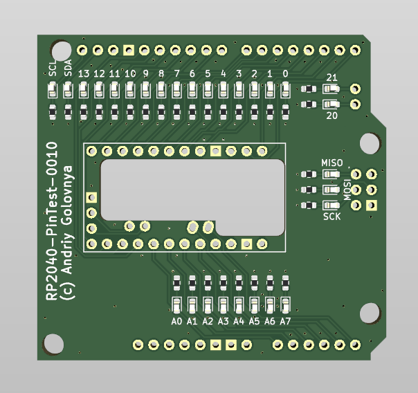

# RP2040-PinTest Project

The **RP2040-PinTest** project aims to display pin function with a simple LED.

## RP2040-PinTest Board

The **RP2040-PinTest** board is a simple 2-layer intended to test RP2040-Eins and RP2040-ProMini boards.

Preview:

You can view the [Schematics in PDF format](doc/RP2040-PinTest.pdf) for detailed information.

Features:

- Uses Uno and ProMini footprints.
- Inidividual LED for each data pin.

## Version History

### v1.0b1

Initial release for testing purposes.

## How to Help

Your contributions as code, resources, or finances are welcome! Please contact me directly via email at andriy.golovnya@gmail.com or through my [GitHub profile](https://github.com/red-scorp).

If you'd like to make a financial contribution, you can donate via [PayPal](http://paypal.me/redscorp) or [Ko-Fi](http://ko-fi.com/redscorp). Your support is greatly appreciated.

Thanks in advance!